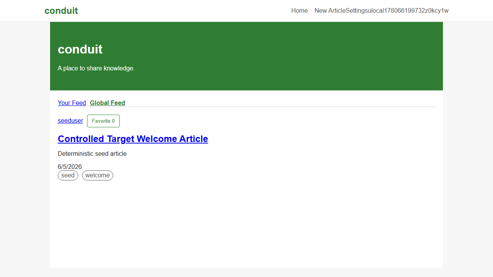
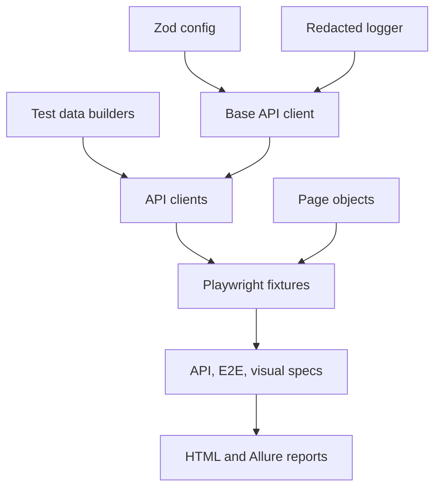

# Playwright TypeScript Framework for Conduit RealWorld

[](https://playwright.dev/)
[](https://nodejs.org/)
[](https://github.com/qa-test-automation-frameworks/playwright-typescript-framework/actions/workflows/ci.yml)
[](https://qa-test-automation-frameworks.github.io/playwright-typescript-framework/)

Modern browser automation as an engineered product: a repo-owned controlled
target, strict TypeScript, typed API clients, Zod contracts, reusable fixtures,
visual baselines, Axe accessibility checks, sharded CI, observability, and
report-grade failure diagnostics.

## Reviewer Proof

| Evidence              | Link                                                                                                                                                                                                                                         |
| --------------------- | -------------------------------------------------------------------------------------------------------------------------------------------------------------------------------------------------------------------------------------------- |
| Live report           | [Allure history](https://qa-test-automation-frameworks.github.io/playwright-typescript-framework/)                                                                                                                                           |
| Release               | [Releases](https://github.com/qa-test-automation-frameworks/playwright-typescript-framework/releases)                                                                                                                                        |
| CI                    | [](https://github.com/qa-test-automation-frameworks/playwright-typescript-framework/actions/workflows/ci.yml)      |
| Repository activity   | [Default-branch commits](https://github.com/qa-test-automation-frameworks/playwright-typescript-framework/commits/main/) · [Pull requests](https://github.com/qa-test-automation-frameworks/playwright-typescript-framework/pulls?q=is%3Apr) |
| Docs and assets       | [Documentation](docs) · [Screenshots](docs/assets/screenshots)                                                                                                                                                                               |
| Best failure evidence | [Failure example](docs/failure-example.md)                                                                                                                                                                                                   |



## What This Framework Proves

| Engineering question                               | Implemented answer                                                                                     |
| -------------------------------------------------- | ------------------------------------------------------------------------------------------------------ |
| How can broad browser coverage stay deterministic? | A repo-owned Conduit target, stable seed data, explicit project boundaries, and pinned browser images. |
| How are API and UI layers kept coherent?           | Typed API clients, Zod validation, API-driven setup, and page objects share controlled contracts.      |
| How are failures made actionable?                  | Screenshots, traces, HTML and Allure reports, redacted logs, runtime metrics, and documented triage.   |
| How is flakiness governed?                         | Project-specific retry rules, a retry budget, expiring quarantine metadata, and scheduled analytics.   |
| How does CI scale?                                 | Linux and Windows jobs, UI and visual shards, browser smoke projects, and machine-readable metrics.    |

## Release Notes Summary

Current `main` includes cross-platform line-ending enforcement, project-specific
retry policy, machine-readable runtime and retry metrics, expiring quarantine
governance, OpenTelemetry support, and explicit controlled-target limitations.
See [CHANGELOG.md](CHANGELOG.md).

## Quality Gates

Run the full local verification gate:

```bash
npm run verify:target
```

The gate runs:

- `npm run format:check`
- `npm run check:runtime`
- `npm run lint`
- `npm run type-check`
- `npm run check:secrets`
- `npm run check:anti-patterns`
- `npm run check:visual-snapshots`
- `npm run check:openapi-contract`
- `npm run with:target -- npm run check:env`
- `npm run test:api`
- `npm run test:e2e`
- `npm run test:visual`
- `npm run test:accessibility`
- `npm run test:contracts`
- `npm run test:cross-browser`
- scheduled `npm run test:cross-browser:full`

CI enforces formatting, linting, type checking, secret scanning, anti-pattern scanning, visual snapshot hygiene, OpenAPI/Zod contract alignment, environment readiness, API tests, sharded authenticated and anonymous UI tests, sharded visual tests, Axe accessibility tests, selector-contract tests, and cross-browser smoke tests against the local controlled target. Linux jobs run inside the pinned `mcr.microsoft.com/playwright:v1.60.0-noble` image. Report artifacts include Allure results, JUnit XML, JSON results, and Playwright HTML output. The visual job runs on Windows to match the committed `win32` Chromium baselines.

## Controlled Target Workflow

The local target lives in `test-target/` and implements the Conduit API/UI contract used by the tests. It starts with deterministic seed credentials:

```bash
npm run target:start
npm run with:target -- npm run check:env
npm run with:target -- npm run test:api
npm run verify:target
```

Default target values are injected only by the target wrapper and are fixture-only values:

- base URL: `http://127.0.0.1:4300`
- API URL: `http://127.0.0.1:4300/api`
- seed user email: `seed.user@example.test`
- seed user password: fixture value generated by `scripts/target-runner.js`
- seed username: `seeduser`

Use `npm run target:seed` while the target is running to reset data to the known baseline.

## Test Strategy

- API tests validate authentication, article, comment, profile, and feed contracts through typed API clients.
- E2E tests cover focused user workflows through page objects and explicit navigation.
- Visual tests compare stable Chromium screenshots against committed baselines under `tests/visual`.
- Accessibility tests scan critical authenticated and unauthenticated pages with Axe.
- Authenticated and anonymous browser projects are separated in Playwright config so login tests do not inherit saved user state.

## Architecture



## Project Structure

```text
src/api/          Typed API clients and Zod models
src/builders/     Deterministic test data builders
src/fixtures/     Playwright fixtures for auth, API clients, scenarios, observability, and page objects
src/observability/ Optional OpenTelemetry helpers and Playwright step wrappers
src/pages/        Page objects and reusable components
src/utils/        Config, logging, and custom matchers
tests/api/        API contract checks
tests/accessibility/ Axe accessibility checks
tests/contracts/  Selector contract checks for controlled UI test IDs
tests/e2e/        Browser workflows
tests/setup/      Report-visible setup and teardown projects
tests/visual/     Visual regression checks and baselines
test-target/      Repo-owned Conduit-compatible API and UI target
docs/adr/         Architecture decision records
docs/openapi/     Controlled target OpenAPI contract source
```

## Setup

Use Node 20 or newer, with Node 20 listed in `.nvmrc` and `.node-version` as the baseline runtime.

```bash
npm ci
npx playwright install chromium
cp .env.example .env
```

For normal local verification, prefer `npm run verify:target` instead of hand-maintaining `.env`. For exploratory external runs, update `.env` with credentials for a test account and explicit target URLs. Do not commit `.env`, `.auth`, reports, traces, screenshots, or generated browser artifacts.

## Selector Contract

The controlled UI exposes stable `data-testid` values for repeated or test-critical surfaces such as article cards, article body, article author, article title, article description, article date, sidebar tag lists, comments, validation errors, profile links, and profile fields. Page objects centralize these IDs in `src/pages/test-ids.ts` and otherwise prefer roles, labels, placeholders, and scoped locators.

## Fixture Contract

API fixtures intentionally separate anonymous and authenticated clients:

- `anonymousApiClient`, `anonymousAuthApi`, and `createAnonymousAuthApi()` cover registration, login, and unauthenticated boundary checks without an `Authorization` header.
- `authenticatedApiClient`, `authenticatedAuthApi`, `articleApi`, `commentApi`, and `profileApi` cover protected domain operations using the setup user's token.
- `baseApiClient` remains as the authenticated compatibility alias for older specs; new tests should prefer the explicit anonymous/authenticated names.
- Browser tests that need alternate users install token state through `installUserToken()` instead of writing localStorage keys inline.

## Observability

OpenTelemetry is opt-in for local runs:

```bash
npm run observability:up
npm run test:otel
npm run observability:down
```

`OTEL_ENABLED=true` starts per-test root spans, observed Playwright step spans, API request spans, and cleanup spans. Each test result includes an `otel-trace-context.txt` attachment with the trace and span identifiers. Jaeger is available at `http://127.0.0.1:16686` when the observability profile is running.

## Flakiness Analytics

Run `npm run flake:report` after a Playwright JSON result is available to write
`test-results/flake-report.md` and `test-results/portfolio-metrics-v1.json`.
Scheduled CI enforces the retry budget with `npm run flake:check`. See
[Flakiness policy](docs/flakiness-policy.md).

## Reports

- Playwright HTML: `playwright-report/`
- Allure results: `allure-results/`
- JUnit XML: `test-results/junit.xml`
- JSON results: `test-results/results.json`
- Portfolio metrics: `test-results/portfolio-metrics-v1.json`

### CI Matrix Summary

| Surface                              | Matrix or shards                 | Retry policy |
| ------------------------------------ | -------------------------------- | ------------ |
| API                                  | 1 Linux job                      | 0            |
| Authenticated and anonymous Chromium | 2 Linux shards                   | 1 UI retry   |
| Visual Chromium                      | 2 Windows shards                 | 0            |
| Accessibility and selector contracts | 1 Linux job each                 | 0            |
| Browser smoke                        | Firefox, WebKit, mobile Chromium | 1 UI retry   |

Current workflow duration and sample size are published on the
[portfolio dashboard](https://qa-test-automation-frameworks.github.io/.github/).

The `CI` workflow publishes Allure history from green default-branch controlled-target results to the `gh-pages` branch. The manual `Allure Report Deploy` workflow can republish the same report path on demand.

## License And Attribution

This project is licensed under the [MIT License](LICENSE). When cloning, forking, redistributing, or deriving work from this repository, preserve the license notice and attribute the original source to Prayag Vyas (`prayagv`) as described in [NOTICE](NOTICE).

## Portfolio Review Path

- Latest CI workflow: [GitHub Actions CI](https://github.com/qa-test-automation-frameworks/playwright-typescript-framework/actions/workflows/ci.yml)
- Published report: [Allure history](https://qa-test-automation-frameworks.github.io/playwright-typescript-framework/)
- High-signal tests: `tests/api`, `tests/e2e/article-lifecycle.spec.ts`, `tests/contracts/selectors/controlled-ui.selectors.spec.ts`, `tests/visual`, and `tests/accessibility`
- Local proof command: `npm run verify:target`
- Verification evidence: [Verification evidence](docs/verification-evidence.md)

## Public Readiness Checklist

- No untracked publishable files; every accepted `tests/visual/**/*-snapshots/*.png` baseline is listed in `tests/visual/visual-snapshots.manifest.json`.
- No ignored reports, traces, screenshots, videos, `.auth`, or local environment files committed.
- `npm run verify:target` is green on Node 20.
- GitHub Actions is green against the controlled target on the public default branch.
- CI and Allure badges point to the repository workflow and GitHub Pages report URLs.
- Confirm at least one meaningful initial commit exists before publishing.

For deterministic CI, use the repo-owned controlled target or point `BASE_URL` and `API_URL` at a controlled RealWorld-compatible deployment, not a public demo service. See [Controlled Test Environment](docs/CONTROLLED_TEST_ENVIRONMENT.md). The checked-in Docker Compose harness runs the repo-owned Conduit-compatible target on port `4300`; set `TEST_USER_PASSWORD` explicitly before starting it.

## Commands

```bash
npm test                 # Run all configured Playwright projects
npm run test:api         # API suite
npm run test:e2e         # Authenticated and anonymous E2E suites
npm run test:visual      # Visual suite
npm run test:accessibility
npm run test:contracts
npm run test:cross-browser
npm run test:cross-browser:full
npm run test:smoke       # Smoke-tagged tests
npm run check:secrets
npm run test:update-snapshots
npm run check:env
npm run check:runtime
npm run check:visual-snapshots
npm run check:openapi-contract
npm run test:otel
npm run clean
npm run allure:generate
```

## Design Notes

- Page fixtures instantiate page objects only; tests and helper methods perform navigation explicitly.
- Test-scoped cleanup fixtures register resources as they are created and clean them after each test, which keeps `fullyParallel` execution safe from shared cleanup state.
- Anonymous and authenticated API fixture boundaries are explicit so auth endpoint tests do not accidentally inherit setup-user authorization.
- API debug logging is opt-in with `DEBUG_API=true` and redacts tokens, passwords, authorization headers, and emails.
- Test data builders prefix generated usernames, emails, article titles, and tags with `TEST_RUN_ID` when provided.
- Visual execution uses a fixed Chromium viewport, UTC timezone, `en-US` locale, light color scheme, reduced motion, and a Windows CI runner that matches the committed `win32` baselines.
- Visual snapshot hygiene fails the quality gate when accepted baselines are missing from `tests/visual/visual-snapshots.manifest.json`.
- The controlled target API contract is documented in `docs/openapi/conduit-controlled-target.openapi.json` and checked against runtime Zod response schemas.
- Network interception coverage demonstrates controlled API failure handling through `page.route()`.

## Known Limitations

- User accounts cannot be deleted through the public API, so tests use unique generated users and clean up deletable resources such as articles/comments.
- Generated reports are intentionally ignored by Git; publish only clean CI artifacts from green runs.
- The Docker Compose harness runs the repo-owned Conduit-compatible target for deterministic local checks. External RealWorld-compatible deployments remain supported through explicit `BASE_URL`, `API_URL`, and seeded-user environment variables.
- User retention and cleanup rules are documented in [Data isolation and retention](docs/data-isolation-and-retention.md).

## Documentation

- [Architecture](docs/Architecture.md)
- [Configuration guide](docs/configuration-guide.md)
- [Debugging test failures](docs/debugging-test-failures.md)
- [Dos and don'ts](docs/dos-and-dont.md)
- [Execution guide](docs/execution-guide.md)
- [Observability](docs/Observability.md)
- [Writing tests](docs/writing-tests.md)
- [Portfolio review guide](docs/portfolio-review-guide.md)
- [Engineering history](docs/engineering-history.md)
- [Flakiness policy](docs/flakiness-policy.md)
- [Flake report example](docs/flake-report-example.md)
- [Failure example and triage](docs/failure-example.md)
- [Seeded defect examples](docs/seeded-defects.md)
- [Contributing guide](docs/CONTRIBUTING.md)
- [Controlled test environment](docs/CONTROLLED_TEST_ENVIRONMENT.md)
- [Data isolation and retention](docs/data-isolation-and-retention.md)
- [Test strategy matrix](docs/test-strategy-matrix.md)
- [Verification evidence](docs/verification-evidence.md)
- [Controlled target OpenAPI contract](docs/openapi/conduit-controlled-target.openapi.json)
- [ADR-001: Playwright over Cypress](docs/adr/ADR-001-playwright-over-cypress.md)
- [ADR-002: Conduit as Target](docs/adr/ADR-002-conduit-as-target-app.md)
- [ADR-003: Hybrid API + UI Strategy](docs/adr/ADR-003-hybrid-api-ui-strategy.md)
- [ADR index](docs/adr/README.md)
