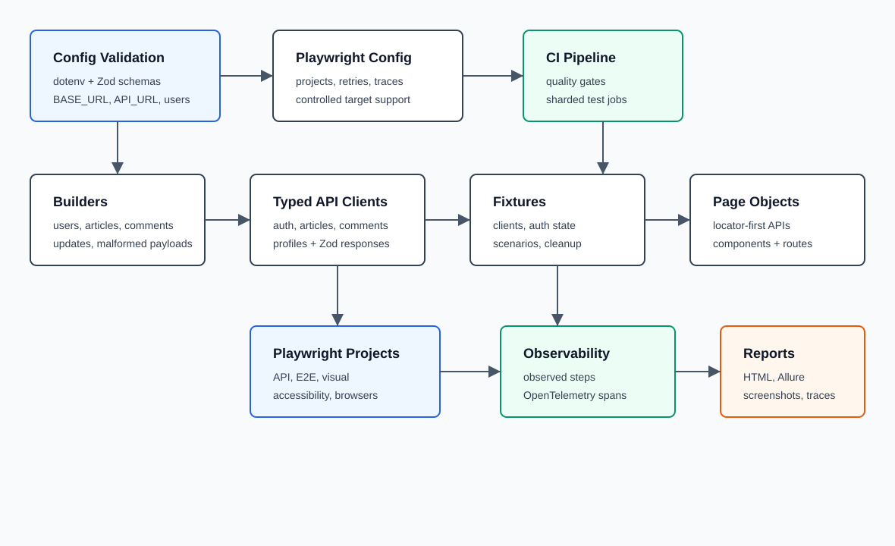
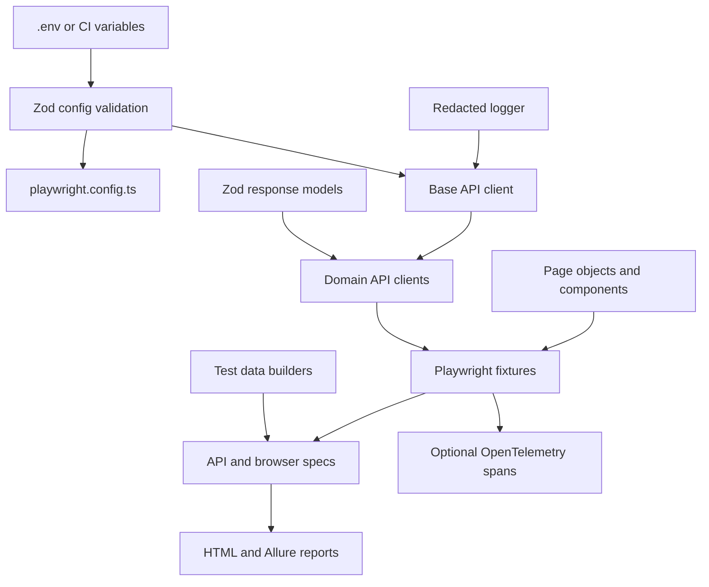

# Architecture

This framework validates the Conduit RealWorld application through Playwright, TypeScript, typed API clients, page objects, custom fixtures, visual checks, accessibility scans, optional OpenTelemetry tracing, and CI sharding.

## Runtime Flow

## Main Layers

- `src/utils/config.ts` loads environment variables with `dotenv` and validates all required values through Zod before tests run.
- `src/api/BaseApiClient.ts` centralizes request execution, status handling, response parsing, schema validation, and redacted logging.
- `src/api/clients` provides domain clients for auth, articles, comments, and profiles.
- `src/api/models` defines Zod schemas and inferred TypeScript types for API contracts.
- `src/builders` creates unique users, articles, comments, and tags. `TEST_RUN_ID` is used when present to keep CI data traceable.
- `src/pages` contains page objects and reusable page components. Specs interact with product flows through these objects instead of duplicating selectors.
- `src/fixtures` composes Playwright fixtures for authenticated API contexts, domain clients, scenario setup, page objects, observability, and cleanup.
- `src/observability` contains optional OpenTelemetry initialization, span helpers, and `observedStep()`.
- `src/utils/cleanup-registry.ts` tracks created resources, emits cleanup spans when tracing is enabled, and fails tests when cleanup cannot complete.

## Playwright Projects

`playwright.config.ts` defines separate projects for setup, teardown, API, authenticated Chromium, anonymous Chromium auth flows, visual checks, accessibility checks, and cross-browser smoke coverage.

The setup project authenticates the shared test user and writes `.auth/user.json`. Projects that need authenticated browser state depend on setup. The teardown project removes seeded data after dependent projects complete.

## Reporting And Artifacts

The framework emits Playwright HTML and Allure results. Screenshots are captured only on failure, videos are retained on failure, and traces are recorded on first retry. Generated artifacts are ignored by git.

## CI Structure

`.github/workflows/ci.yml` runs formatting, linting, type checking, secret scanning, environment readiness, API tests, sharded E2E tests, sharded visual tests, accessibility checks, and cross-browser smoke tests. Allure results are uploaded from each test job and can be published from the main branch.
