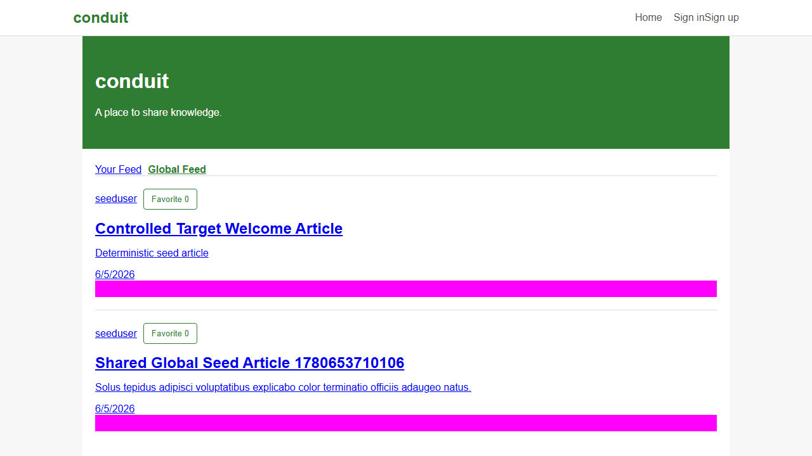

# Execution Guide



## Install

```bash
npm ci
npx playwright install chromium
cp .env.example .env
```

For the repo-owned target, prefer `npm run verify:target`; the wrapper injects fixture-only target values. Use `.env` only for external exploratory targets.

## Full Verification

```bash
npm run verify:target
```

This starts the controlled target, checks Node/npm runtime compatibility, then runs formatting checks, linting, type checking, secret scanning, anti-pattern scanning, environment readiness, API tests, E2E tests, visual tests, accessibility tests, and cross-browser smoke tests.

## Targeted Test Commands

```bash
npm test
npm run test:api
npm run test:e2e
npm run test:smoke
npm run test:visual
npm run test:accessibility
npm run test:cross-browser
```

## Observability

```bash
npm run observability:up
npm run test:otel
npm run observability:down
```

Use this path when validating OpenTelemetry spans in Jaeger. Normal verification does not export telemetry.

## Single Spec Or Project

```bash
npx playwright test tests/api/auth.api.spec.ts --project=api
npx playwright test tests/e2e/auth.spec.ts --project=chromium-anonymous
npx playwright test tests/e2e/article-lifecycle.spec.ts --project=chromium-authenticated
```

## UI Runner

```bash
npm run test:ui
```

Use this for local debugging when seeing the browser state is faster than reading traces.

## Sharding

Local shard helpers:

```bash
npm run test:e2e:shard
npm run test:visual:shard
```

CI shards E2E and visual jobs directly through Playwright's `--shard` option.

## Visual Snapshots

Update snapshots only after reviewing the diff:

```bash
npm run test:update-snapshots
```

Snapshot files live under `tests/visual`.

## Reports

Generate Allure from completed test results:

```bash
npm run allure:generate
npm run allure:open
```

Serve raw Allure results directly:

```bash
npm run allure:serve
```

## Cleanup

```bash
npm run clean
```

This removes `.auth`, Allure output, Playwright reports, and test results.
