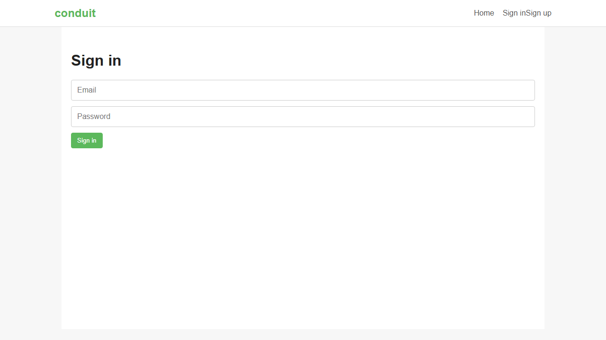

# Portfolio Review Guide



This repository is structured to show a maintainable Playwright and TypeScript testing framework for a RealWorld-style application.

## What To Review

- `playwright.config.ts` for project separation, retries, workers, reporters, artifacts, setup dependencies, visual settings, and cross-browser smoke coverage.
- `src/api` for typed API clients, Zod models, schema validation, and centralized error handling.
- `src/fixtures` for fixture composition across auth, API clients, page objects, and cleanup.
- `src/pages` for page object design and selector containment.
- `tests/api`, `tests/e2e`, `tests/visual`, and `tests/accessibility` for coverage across contract, workflow, visual, and accessibility concerns.
- `.github/workflows/ci.yml` for quality gates, sharding, artifact upload, and Allure publication flow.

## Verification Commands

Run the complete gate:

```bash
npm run verify:target
```

Run smaller checks while reviewing:

```bash
npm run lint
npm run type-check
npm run check:secrets
npm run check:env
npm run test:api
npm run test:e2e
```

## Engineering Signals

The framework demonstrates:

- Strict TypeScript and schema-validated API responses.
- Clear separation between API clients, builders, fixtures, page objects, and specs.
- API-backed setup and cleanup to keep browser tests focused.
- Visual regression checks with stable browser settings.
- Axe accessibility checks on critical pages.
- CI sharding for longer-running browser suites.
- Redacted debug logging and a local secret scan.

## Evidence To Publish

For a public portfolio repository, useful evidence includes:

- A green CI run on the default branch.
- Published Allure or Playwright HTML report artifacts from CI.
- Clear environment setup instructions without committed secrets.
- A concise README with commands, strategy, and limitations.
- Incremental commit history that shows test design and framework decisions.

## Known Limitations To Explain

- Public demo targets are useful for exploration but not deterministic enough for reliable CI.
- User accounts cannot be deleted through the public API, so tests rely on unique generated users.
- Cross-browser coverage is intentionally smoke-level to keep runtime practical.
- Visual baselines require review whenever UI changes are expected.
